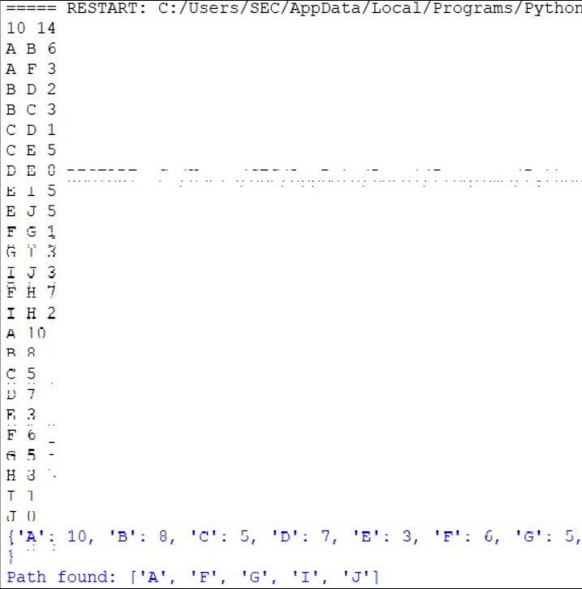
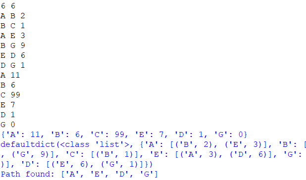

<h1>ExpNo 3 : Implement A* search algorithm for a Graph</h1> 
<h3>Name: Saravana Kumar S</h3>
<h3>Register Number : 212221230088</h3>
<H3>Aim:</H3>
<p>To ImplementA * Search algorithm for a Graph using Python 3.</p>
<H3>Algorithm:</H3>
// A* Search Algorithm
1.  Initialize the open list
2.  Initialize the closed list
    put the starting node on the open 
    list (you can leave its f at zero)

3.  while the open list is not empty
    a) find the node with the least f on 
       the open list, call it "q"

    b) pop q off the open list
  
    c) generate q's 8 successors and set their 
       parents to q
   
    d) for each successor
        i) if successor is the goal, stop search
        
        ii) else, compute both g and h for successor
          successor.g = q.g + distance between 
                              successor and q
          successor.h = distance from goal to 
          successor (This can be done using many 
          ways, we will discuss three heuristics- 
          Manhattan, Diagonal and Euclidean 
          Heuristics)
          
          successor.f = successor.g + successor.h

        iii) if a node with the same position as 
            successor is in the OPEN list which has a 
           lower f than successor, skip this successor

        iV) if a node with the same position as 
            successor  is in the CLOSED list which has
            a lower f than successor, skip this successor
            otherwise, add  the node to the open list
     end (for loop)
  
    e) push q on the closed list
    end (while loop)
<hr>
<h2>Sample Graph I</h2>
<hr>


<hr>
<h2>Program:</h2>

```python
from collections import defaultdict
H_dist ={}
def aStarAlgo(start_node, stop_node):
    open_set = set(start_node)
    closed_set = set()
    g = {}               #store distance from starting node
    parents = {}         # parents contains an adjacency map of all nodes
    #distance of starting node from itself is zero
    g[start_node] = 0
    #start_node is root node i.e it has no parent nodes
    #so start_node is set to its own parent node
    parents[start_node] = start_node
    while len(open_set) > 0:
        n = None
        #node with lowest f() is found
        for v in open_set:
            if n == None or g[v] + heuristic(v) < g[n] + heuristic(n):
                n = v
        if n == stop_node or Graph_nodes[n] == None:
            pass
        else:
            for (m, weight) in get_neighbors(n):
                #nodes 'm' not in first and last set are added to first
                #n is set its parent
                if m not in open_set and m not in closed_set:
                    open_set.add(m)
                    parents[m] = n
                    g[m] = g[n] + weight
                #for each node m,compare its distance from start i.e g(m) to the
                #from start through n node
                else:
                    if g[m] > g[n] + weight:
                        #update g(m)
                        g[m] = g[n] + weight
                        #change parent of m to n
                        parents[m] = n
                        #if m in closed set,remove and add to open
                        if m in closed_set:
                            closed_set.remove(m)
                            open_set.add(m)
        if n == None:
            print('Path does not exist!')
            return None
        
        # if the current node is the stop_node
        # then we begin reconstructin the path from it to the start_node
        if n == stop_node:
            path = []
            while parents[n] != n:
                path.append(n)
                n = parents[n]
            path.append(start_node)
            path.reverse()
            print('Path found: {}'.format(path))
            return path
        # remove n from the open_list, and add it to closed_list
        # because all of his neighbors were inspected
        open_set.remove(n)
        closed_set.add(n)
    print('Path does not exist!')
    return None

#define fuction to return neighbor and its distance
#from the passed node
def get_neighbors(v):
    if v in Graph_nodes:
        return Graph_nodes[v]
    else:
        return None
def heuristic(n):
    return H_dist[n]


#Describe your graph here
'''Graph_nodes = {
    'A': [('B', 6), ('F', 3)],
    'B': [('A', 6), ('C', 3), ('D', 2)],
    'C': [('B', 3), ('D', 1), ('E', 5)],
    'D': [('B', 2), ('C', 1), ('E', 8)],
    'E': [('C', 5), ('D', 8), ('I', 5), ('J', 5)],
    'F': [('A', 3), ('G', 1), ('H', 7)],
    'G': [('F', 1), ('I', 3)],
    'H': [('F', 7), ('I', 2)],
    'I': [('E', 5), ('G', 3), ('H', 2), ('J', 3)],
}
'''
graph = defaultdict(list)
n,e = map(int,input().split())
for i in range(e):
    u,v,cost = map(str,input().split())
    t=(v,float(cost))
    graph[u].append(t)
    t1=(u,float(cost))
    graph[v].append(t1)
for i in range(n):
    node,h=map(str,input().split())
    H_dist[node]=float(h)
print(H_dist)

   
Graph_nodes=graph
print(graph)
aStarAlgo('S', 'G')
```

<h2>Sample Input</h2>
<hr>
10 14 <br>
A B 6 <br>
A F 3 <br>
B D 2 <br>
B C 3 <br>
C D 1 <br>
C E 5 <br>
D E 8 <br>
E I 5 <br>
E J 5 <br>
F G 1 <br>
G I 3 <br>
I J 3 <br>
F H 7 <br>
I H 2 <br>
A 10 <br>
B 8 <br>
C 5 <br>
D 7 <br>
E 3 <br>
F 6 <br>
G 5 <br>
H 3 <br>
I 1 <br>
J 0 <br>
<hr>
<h2>Sample Output</h2>


<hr>
<h2>Sample Graph II</h2>
<hr>


<hr>
<h2>Sample Input</h2>
<hr>
6 6 <br>
A B 2 <br>
B C 1 <br>
A E 3 <br>
B G 9 <br>
E D 6 <br>
D G 1 <br>
A 11 <br>
B 6 <br>
C 99 <br>
E 7 <br>
D 1 <br>
G 0 <br>
<hr>
<h2> Output</h2>
<hr>



<h3>Result</h3>
Thus the program for implementing Astar search is successfully implemented.